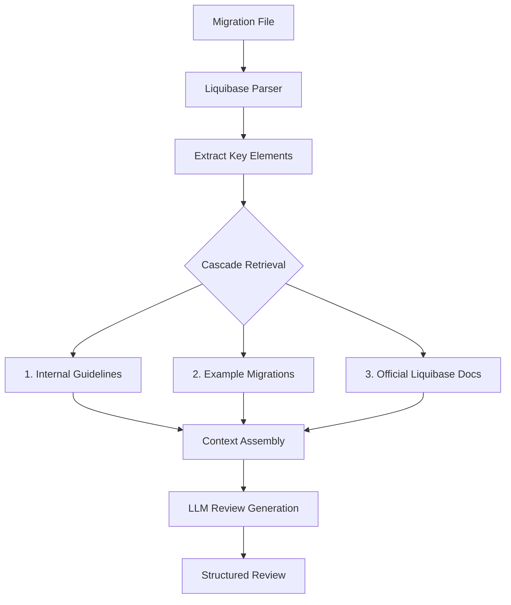
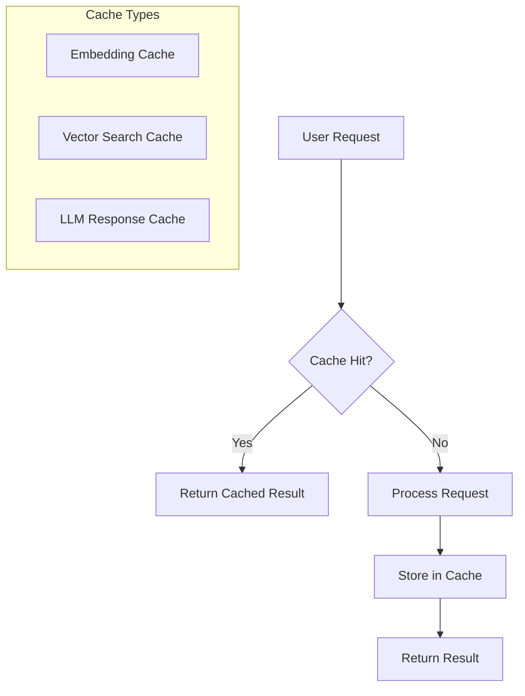

# Database Copilot Enhancement Plan: LLM Cascade Flow & Performance Optimization

After analyzing the Database Copilot codebase, I've developed a comprehensive plan to implement the requested production-ready LLM cascade flow and performance improvements. This plan builds on the existing architecture while introducing significant enhancements to both the review process and system performance.

## Current Architecture Analysis

The Database Copilot is a local RAG-based system with several key components:

1. **LLM Integration**: Uses open-source models (Mistral 7B, CodeLlama, etc.) loaded via Hugging Face or llama.cpp
2. **Vector Database**: ChromaDB for storing and retrieving relevant documentation
3. **Liquibase Parser**: Processes XML/YAML migrations into structured data
4. **Retrieval System**: Fetches relevant documents from different collections
5. **Review Pipeline**: Combines migration content, parsed structure, and retrieved context

The current QA system already implements a basic priority system (internal guidelines → example migrations → official docs), but the Liquibase reviewer doesn't fully leverage this prioritization approach.

## 1. Production-Grade LLM Cascade Design

I propose implementing a 3-tier cascade system that prioritizes information sources in this order:

### A. Enhanced Retrieval Architecture



### B. Implementation Strategy

1. **Modify `LiquibaseReviewer` Class**:
   - Refactor the retrieval methods to implement cascading priority
   - Add threshold-based retrieval to prioritize higher-quality sources
   - Enhance context assembly to clearly indicate source priority

2. **Create New `CascadeRetriever` Class**:
   - Implement a specialized retriever that queries collections in priority order
   - Add configurable thresholds to determine when to fall back to lower-priority sources
   - Support weighted retrieval to balance results from different sources

3. **Enhance Context Formatting**:
   - Clearly label each source in the prompt with priority indicators
   - Order context sections by priority (internal first, then examples, then official docs)
   - Include explicit instructions in the prompt about prioritization

4. **Improve Parsing Precision**:
   - Enhance the migration parser to extract more specific elements (constraints, indexes, etc.)
   - Generate more targeted queries based on specific migration elements
   - Create specialized retrievers for different migration components

### C. Code Changes

The key modifications will be in `backend/models/liquibase_reviewer.py`:

```python
def _get_relevant_documents(self, parsed_migration: Dict[str, Any]) -> Dict[str, List[str]]:
    """
    Get relevant documents based on the migration, using a priority system.
    
    Priority order:
    1. Internal Guidelines (highest priority)
    2. Example Migrations (YAML and XML)
    3. Liquibase Documentation
    """
    relevant_docs = {}
    min_docs_threshold = 3  # Minimum number of relevant documents to consider sufficient
    total_docs = 0
    
    # Extract key elements from the migration
    table_names = self._extract_table_names(parsed_migration)
    change_types = self._extract_change_types(parsed_migration)
    constraints = self._extract_constraints(parsed_migration)  # New method
    
    # Create targeted queries
    table_query = f"Database guidelines for tables: {', '.join(table_names)}"
    change_query = f"Migration patterns for: {', '.join(change_types)}"
    constraint_query = f"Constraint guidelines for: {', '.join(constraints)}"
    
    # 1. First priority: Internal Guidelines
    internal_guidelines = []
    internal_guidelines.extend(self._get_relevant_internal_guidelines(table_query))
    internal_guidelines.extend(self._get_relevant_internal_guidelines(change_query))
    internal_guidelines.extend(self._get_relevant_internal_guidelines(constraint_query))
    
    if internal_guidelines:
        relevant_docs["internal_guidelines"] = internal_guidelines
        total_docs += len(internal_guidelines)
    
    # 2. Second priority: Example Migrations (only if we don't have enough from higher priority)
    if total_docs < min_docs_threshold:
        example_migrations = self._get_relevant_example_migrations(
            f"Example migrations with: {', '.join(change_types)} on tables: {', '.join(table_names)}"
        )
        if example_migrations:
            relevant_docs["example_migrations"] = example_migrations
            total_docs += len(example_migrations)
    
    # 3. Third priority: Liquibase Documentation
    if total_docs < min_docs_threshold:
        liquibase_docs = self._get_relevant_liquibase_docs(
            f"Liquibase documentation for: {', '.join(change_types)}"
        )
        if liquibase_docs:
            relevant_docs["liquibase_docs"] = liquibase_docs
    
    return relevant_docs
```

And updating the context assembly:

```python
def _combine_context(self, relevant_docs: Dict[str, List[str]]) -> str:
    """
    Combine context from different sources in priority order.
    """
    context_parts = []
    
    # 1. First priority: Internal Guidelines
    if "internal_guidelines" in relevant_docs and relevant_docs["internal_guidelines"]:
        context_parts.append("## Internal Guidelines (Highest Priority)\n\n" + 
                            "\n\n".join(relevant_docs["internal_guidelines"]))
    
    # 2. Second priority: Example Migrations
    if "example_migrations" in relevant_docs and relevant_docs["example_migrations"]:
        context_parts.append("## Example Migrations (High Priority)\n\n" + 
                            "\n\n".join(relevant_docs["example_migrations"]))
    
    # 3. Third priority: Liquibase Documentation
    if "liquibase_docs" in relevant_docs and relevant_docs["liquibase_docs"]:
        context_parts.append("## Liquibase Documentation (Medium Priority)\n\n" + 
                            "\n\n".join(relevant_docs["liquibase_docs"]))
    
    return "\n\n".join(context_parts)
```

### D. Prompt Enhancement

The review prompt will be updated to explicitly instruct the LLM about prioritization:

```python
prompt = ChatPromptTemplate.from_template("""
You are a Liquibase migration reviewer. Your task is to review a Liquibase migration against best practices and company guidelines.

# Priority Order for Information Sources
When reviewing, prioritize information in this order:
1. Internal Guidelines (highest priority)
2. Example Migrations (YAML and XML)
3. Liquibase Documentation (lowest priority)

Only fall back to lower priority sources if higher priority sources don't contain relevant information.

# Migration to Review
```{format_type}
{migration_content}
```

# Parsed Migration Structure
```
{parsed_migration}
```

# Reference Documentation and Guidelines
{context}

Please provide a detailed review of the migration, including:

1. **Summary**: A brief summary of what the migration does.
2. **Compliance**: Does the migration comply with Liquibase best practices and company guidelines?
3. **Issues**: Identify any issues or potential problems with the migration.
4. **Recommendations**: Provide specific recommendations for improving the migration.
5. **Best Practices**: Highlight any best practices that should be followed.

Format your review in Markdown with clear sections and bullet points where appropriate.
""")
```

## 2. Performance Improvement Strategy

To address performance concerns, I recommend several optimizations:

### A. Caching and Memoization



1. **Implement Multi-Level Caching**:
   - Add embedding caching to avoid re-embedding the same text
   - Cache vector search results for similar queries
   - Implement LLM response caching for identical prompts

2. **Code Implementation**:
   ```python
   # In vector_store.py
   class CachedEmbeddings:
       def __init__(self, embedding_model):
           self.embedding_model = embedding_model
           self.cache = {}
       
       def embed_documents(self, texts):
           # Check cache first
           cache_keys = [self._hash_text(text) for text in texts]
           results = []
           texts_to_embed = []
           indices_to_embed = []
           
           for i, (text, key) in enumerate(zip(texts, cache_keys)):
               if key in self.cache:
                   results.append(self.cache[key])
               else:
                   texts_to_embed.append(text)
                   indices_to_embed.append(i)
           
           # Embed only uncached texts
           if texts_to_embed:
               new_embeddings = self.embedding_model.embed_documents(texts_to_embed)
               for idx, embedding in zip(indices_to_embed, new_embeddings):
                   self.cache[cache_keys[idx]] = embedding
                   results.append(embedding)
           
           return results
   ```

3. **LLM Response Caching**:
   ```python
   # In llm.py
   class CachedLLM:
       def __init__(self, llm, cache_size=100):
           self.llm = llm
           self.cache = {}
           self.cache_size = cache_size
       
       def generate(self, prompt):
           prompt_hash = hash(prompt)
           if prompt_hash in self.cache:
               return self.cache[prompt_hash]
           
           response = self.llm.generate(prompt)
           
           # Implement LRU cache if needed
           if len(self.cache) >= self.cache_size:
               # Remove oldest entry
               oldest_key = next(iter(self.cache))
               del self.cache[oldest_key]
           
           self.cache[prompt_hash] = response
           return response
   ```

### B. Asynchronous Processing

1. **Implement Parallel Retrieval**:
   - Use `asyncio` to query multiple vector stores concurrently
   - Process different parts of the migration in parallel

2. **Code Implementation**:
   ```python
   # In liquibase_reviewer.py
   async def _get_relevant_documents_async(self, parsed_migration):
       # Extract queries
       table_query = self._create_table_query(parsed_migration)
       change_query = self._create_change_query(parsed_migration)
       
       # Run retrievals in parallel
       tasks = [
           self._get_relevant_internal_guidelines_async(table_query),
           self._get_relevant_internal_guidelines_async(change_query),
           self._get_relevant_example_migrations_async(table_query),
           self._get_relevant_liquibase_docs_async(change_query)
       ]
       
       results = await asyncio.gather(*tasks)
       
       # Process and combine results
       # ...
   ```

### C. Model Optimization

1. **Quantization Improvements**:
   - Implement 4-bit and 8-bit quantization options for different models
   - Add configuration options to trade off quality vs. speed

2. **Batch Processing**:
   - Implement batched embedding generation
   - Process multiple documents in a single model forward pass

3. **Code Implementation**:
   ```python
   # In config.py
   # Add configuration options
   QUANTIZATION_LEVEL = "4bit"  # Options: "4bit", "8bit", "none"
   BATCH_SIZE = 16  # For embedding generation
   
   # In llm.py
   def get_llm(model_name=None, quantization_level=None):
       quantization_level = quantization_level or QUANTIZATION_LEVEL
       
       if torch.cuda.is_available():
           if quantization_level == "4bit":
               quantization_config = BitsAndBytesConfig(
                   load_in_4bit=True,
                   bnb_4bit_compute_dtype=torch.float16,
                   bnb_4bit_quant_type="nf4",
                   bnb_4bit_use_double_quant=True,
               )
           elif quantization_level == "8bit":
               quantization_config = BitsAndBytesConfig(
                   load_in_8bit=True,
               )
           else:
               quantization_config = None
       else:
           quantization_config = None
       
       # Load model with appropriate quantization
       # ...
   ```

### D. Input Optimization

1. **Smart Chunking**:
   - Implement migration-aware chunking that preserves logical units
   - Reduce token count by filtering out irrelevant parts of migrations

2. **Preprocessing Filters**:
   - Add lightweight rule-based checks to catch common issues before LLM review
   - Use regex patterns to validate naming conventions

3. **Code Implementation**:
   ```python
   # In liquibase_reviewer.py
   def _preprocess_migration(self, parsed_migration):
       """Apply lightweight rule-based checks before LLM review."""
       issues = []
       
       # Check naming conventions
       for changeset in parsed_migration.get('databaseChangeLog', {}).get('changeSet', []):
           # Check ID format
           if 'id' in changeset:
               if not re.match(r'\d{8}-\d{3}_\w+', changeset['id']):
                   issues.append(f"Changeset ID '{changeset['id']}' does not follow convention YYYYMMDD-NNN_description")
           
           # Check for rollback section
           if 'rollback' not in changeset:
               issues.append(f"Changeset '{changeset.get('id', 'unknown')}' is missing rollback instructions")
       
       return issues
   ```

### E. External LLM Integration Option

1. **Add Support for External APIs**:
   - Implement optional integration with hosted LLM services
   - Add configuration toggle for local vs. cloud processing

2. **Code Implementation**:
   ```python
   # In config.py
   LLM_PROVIDER = "local"  # Options: "local", "openai", "anthropic"
   OPENAI_API_KEY = os.environ.get("OPENAI_API_KEY", "")
   ANTHROPIC_API_KEY = os.environ.get("ANTHROPIC_API_KEY", "")
   
   # In llm.py
   def get_llm(provider=None):
       provider = provider or LLM_PROVIDER
       
       if provider == "openai" and OPENAI_API_KEY:
           from langchain_openai import ChatOpenAI
           return ChatOpenAI(
               model_name="gpt-4o",
               temperature=TEMPERATURE,
               max_tokens=MAX_NEW_TOKENS
           )
       elif provider == "anthropic" and ANTHROPIC_API_KEY:
           from langchain_anthropic import ChatAnthropic
           return ChatAnthropic(
               model_name="claude-3-opus-20240229",
               temperature=TEMPERATURE,
               max_tokens=MAX_NEW_TOKENS
           )
       else:
           # Fall back to local model
           return get_local_llm()
   ```

## 3. Implementation Roadmap

I recommend implementing these changes in the following phases:

### Phase 1: Cascade Retrieval System
1. Implement the priority-based retrieval in `LiquibaseReviewer`
2. Enhance the context assembly to clearly indicate source priority
3. Update the review prompt to include explicit prioritization instructions
4. Add more granular extraction methods for migration elements

### Phase 2: Performance Optimizations
1. Implement caching for embeddings and LLM responses
2. Add asynchronous processing for parallel retrieval
3. Implement quantization options and batch processing
4. Add preprocessing filters for common issues

### Phase 3: External Integration (Optional)
1. Add support for external LLM APIs
2. Implement configuration options for local vs. cloud processing
3. Add hybrid processing modes (e.g., use local for initial checks, cloud for final review)

## 4. Testing Strategy

To validate the improvements:

1. **Benchmark Current Performance**:
   - Measure response times for different migration sizes
   - Evaluate review quality against known issues

2. **Test Cascade Retrieval**:
   - Create test cases with conflicting guidelines
   - Verify that higher-priority sources take precedence

3. **Measure Performance Improvements**:
   - Compare response times with and without caching
   - Evaluate the impact of different quantization levels
   - Measure the effect of parallel processing

4. **Validate Review Quality**:
   - Compare reviews from the enhanced system against expert reviews
   - Ensure that all critical issues are still caught

## Conclusion

This implementation plan provides a comprehensive approach to enhancing the Database Copilot with a production-grade LLM cascade flow and significant performance improvements. The proposed changes build on the existing architecture while introducing more sophisticated retrieval, context assembly, and processing optimizations.

The cascade system ensures that company-specific guidelines take precedence over generic best practices, while the performance enhancements will make the system more responsive and efficient. The modular design allows for future extensions and adaptations as requirements evolve.
